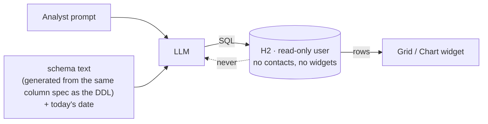

# The generation model: how a business-case dataset is made

How the generator works, on one page. Why it works this way is in [design-decisions.md](design-decisions.md);
how to use it is in [getting-started.md](getting-started.md); how to write a pack is in
[../DOMAIN_GUIDE.md](../DOMAIN_GUIDE.md).

## The idea in one sentence

An LLM authors the *domain pack* (what the world looks like); deterministic code renders the *data*
(thousands of consistent rows); automated checks and a small review queue make sure the result is right;
a snapshot of the output is published so everyone works from the same bytes.

## The process, end to end

Orange boxes are steps a person takes, blue boxes are dsgen, green is the demo application at demo time.
Two steps cost money or judgment and stay with a person: generating the photo and answering the review
queue. Everything between the pack and the facts is deterministic code; the assistant writes data and reacts
to what `validate` and `check` report. The drawing's source is `workflow.svg` in this folder.

## Who does what

| Layer | Done by | Why this split |
|---|---|---|
| Entity model, statuses, business rules, ratios | LLM proposes, human confirms | Needs domain knowledge and taste; done once per domain |
| Name pools, product templates, claim phrasing, e-mails, column descriptions the model reads | LLM writes, in the right language and culture | Text quality is the LLM's strength; volume is small (dozens of templates, a handful of documents) |
| Scenario anchors (the outage week, the Tuesday pallet, the 240-product supplier) | LLM designs from the case, code constructs | A demo needs a story; random data has none |
| Rows: about 240,000 of them, consistent totals, foreign keys, chronology, time anchoring | The flow engine, from `flow.toml`, seeded RNG | Cheap, fast, reproducible, always consistent; an LLM is none of these at this volume. The assistant writes the flow file, not code |
| Verification | Code: SQLite checks, then the real H2 and PostgreSQL as the AI user, plus the fictional-name check | Checks must be exact, not plausible |
| Review of demo-critical text and of every company-like name | Human, guided by a risk score and the name inventory in `REVIEW.md` | Fifteen minutes on the right dozen items beats hours on everything |
| Photos | A person runs the paid command once; the image and its provenance are kept in the pack | Money and licence questions stay with a person |

## What the model sees at demo time

The read-only account, the schema text, the PII report and the hidden tables all derive from one list in
`domain.toml`, so the "what leaves the network" answer is enforced by the database, not by hope.
