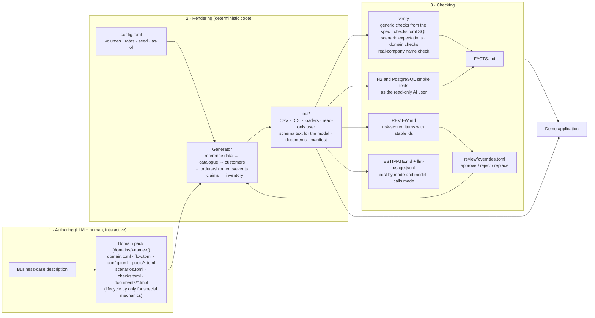
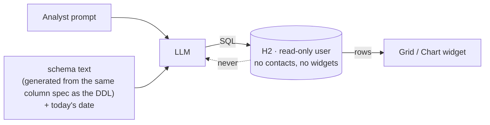

# The generation model: how a business-case dataset is made

A one-page summary for the team of how the dataset generator works today and how it is meant to
work when it serves several business cases. All boxes exist; the review loop is
answered by a human in `review/overrides.toml` and applied on the next generation.

## The idea in one sentence

An LLM authors the *domain pack* (what the world looks like); deterministic code renders the
*data* (thousands of consistent rows); automated checks and a small review queue make sure the
result is right; the outputs are committed so everyone gets the same bytes.

## Who does what

| Layer | Done by | Why this split |
|---|---|---|
| Entity model, statuses, business rules, ratios | LLM proposes, human confirms | Needs domain knowledge and taste; done once per domain |
| Name pools, product templates, claim phrasing, e-mails, column descriptions the model reads | LLM writes, in the right language and culture | Text quality is the LLM's strength; volume is small (dozens of templates, a handful of documents) |
| Scenario anchors (the outage week, the Tuesday pallet, the 240-product supplier) | LLM designs from the case, code constructs | A demo needs a story; random data has none |
| Rows: 244k of them, consistent totals, foreign keys, chronology, time anchoring | The flow engine, from `flow.toml`, seeded RNG | Cheap, fast, reproducible, always consistent — an LLM is none of these at this volume; the assistant writes the flow file, not code |
| Verification | Code (SQLite + real H2) | Checks must be exact, not plausible |
| Review of demo-critical text | Human, guided by a risk score; optional cheap LLM pre-pass | Fifteen minutes on the right dozen items beats hours on everything |

## What the model sees at demo time

The read-only account, the schema text and the hidden tables all derive from one list in the
schema spec, so the "what leaves the network" answer is enforced by the database, not by hope.

## Options built so far

| Option | Flag / file | Purpose |
|---|---|---|
| Framework / domain split | `dsgen/` + `domains/<name>/` | A new business case without touching framework code; two packs exist |
| Declarative flow engine | `flow.toml` | Rows, fields, statuses, bursts and anchors as data; the insurance pack has no generation code |
| Pack validation | `validate` (runs before every generation) | Machine-checked contracts for LLM-authored packs |
| Scaffold and guide | `new-domain`, `DOMAIN_GUIDE.md`, skill `author-domain` | Authoring starts from green |
| Move the story in time | `--as-of 2026-11-02` | "Last month", "over 7 days", "first of next month" always hold |
| Change volumes and rates | `config.toml`, `--config my.toml` | Realistic vs. pessimistic rates, chain list, seasonality, claim rates |
| Scale | `--scale 0.3` | Small for tests, large for load |
| Two database dialects | `schema-*.sql`, `load-*.sql`, `readonly-user-*.sql`, `ai-schema-*.txt` | H2 for clone-and-run, PostgreSQL for hosted |
| One-command check | `check`, `--pg`, `--h2-file` | Verify + H2 (+ PostgreSQL) smoke tests + database file + FACTS.md |
| Personal data classification | `pii = "..."` tags → `pii-columns.json`, DDL comments | Masking rules and audits from one source; controlled PII in free text |
| Declarative scenarios | `scenarios.toml`, `documents/*.tmpl` | Documents, images and expectations without code |
| Image generation with provenance | `--images openai|google` (placeholder default) | Photos that match the anchor record; `*.provenance.json` per image |
| Reproducibility | `manifest.json`: versions, seed, as-of, config, Python, SHA-256 per table | Diff two runs, detect unintended change |
| Fictional-name check | `dsgen/names.py` in `verify`; `[names] deny/allow` in a pools file; inventory in `REVIEW.md` | No real brand, retailer or carrier, not even as a stem; no generic shop word next to a real town |
| Published snapshot | `scripts/snapshot.sh <domain>` → `datasets/<domain>/` | The build the app team uses; `scripts/test.sh` fails while it is stale |
| Date matrix and CI | `scripts/test.sh` regenerates every pack for three other as-of dates; `.github/workflows/tests.yml` | The "move the demo in time" promise is tested, on Python 3.11 and 3.13 |

| Review queue and overrides | `REVIEW.md`, `review-queue.json`, `review/overrides.toml` | Targeted human review with stable ids, answers applied deterministically on the next run |
| Cost instrumentation | `llm-usage.jsonl`, `ESTIMATE.md`, `estimate` command, `dsgen/prices.toml` | Log every provider call; predict cost by authoring mode and model without calling anyone |

## Deferred (need API keys)

| Item | Why deferred |
|---|---|
| Live image generation for the scenario photos | Provider terms and key are a team decision |
| Cost-calibration runs (measured tokens per item across models) | Spend real money; the offline estimate uses list prices and measured text sizes instead |

## Why not simply ask an LLM for the data?

Rendering 244k rows with an LLM would cost roughly $50–250 per run, take hours, and produce
totals that do not add up, dates that overlap, and a different dataset every time. Rendering the
*templates* and *stories* with an LLM and the rows with code costs cents, takes four seconds, and
produces the same bytes for everyone. The measured text volume of this dataset (about 150k tokens
of names, descriptions, claim texts and e-mails) shows that even writing every sentence with an
LLM would cost a few dollars — cost is not the reason for the split; consistency and
reproducibility are.
