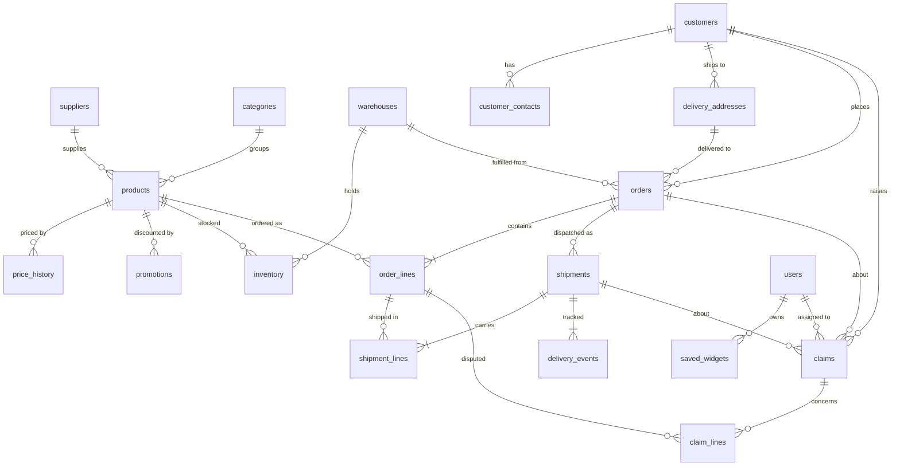

# Data model

Nordic Supply is a wholesaler of sports, hiking and outdoor equipment. It buys from **suppliers**
(brands), keeps **products** in three **warehouses**, and sells to retail **customers** (chains,
independent shops, online stores, rental outfitters). A customer places an **order** with
**order lines**; the order desk dispatches one or more **shipments** (with **shipment lines** on
numbered pallets) that produce **delivery events**; when something goes wrong the customer raises
a **claim** with **claim lines**. Prices live in **price history**; time-boxed **promotions**
override them. Employees are **users**.

## Conventions

* One CSV per table in `out/csv/`, UTF-8, header row, comma separated, `"` quoting only when
  needed. **Column order equals the `CREATE TABLE` order**, so `INSERT INTO t SELECT * FROM
  CSVREAD(...)` works without a column list.
* Empty field = `NULL`. Booleans are `true`/`false`. Dates are `YYYY-MM-DD`, timestamps
  `YYYY-MM-DD HH:MM:SS` (no time zone; treat as local time, Europe/Helsinki).
* Money is EUR with two decimals. Quantities are in the product's `unit` (`pcs` or `pair`).
* Ids are dense integers starting at 1. Business keys are human-readable:
  `C-10001` (customer), `FJV-TNT-0010` (SKU = supplier code, category code, sequence),
  `SO-2026-001234` (order), `SH-2026-001234` (shipment), `CL-2026-00123` (claim).
* Country codes are ISO-2: FI, SE, NO, DK, DE, EE.

## Tables

### Reference data

| Table | Rows | Purpose |
|---|---:|---|
| `users` | 12 | Nordic Supply employees. `role`: ADMIN, ANALYST, SUPPORT_AGENT, CATALOGUE_MANAGER, ACCOUNT_MANAGER, WAREHOUSE. `test.user` (ADMIN) is the demo login and matches the design mock-up. |
| `warehouses` | 3 | VAN Vantaa (FI), GOT Göteborg (SE), OSL Oslo cross-dock (NO). FI/EE orders ship from VAN, SE/DK/DE from GOT, NO 60/40 from GOT/OSL. |
| `categories` | 14 | Flat list: Tents & Shelters, Sleeping Bags & Mats, Backpacks & Bags, Footwear, Shell & Insulated Apparel, Base & Mid Layers, Climbing, Camp Kitchen, Navigation & Electronics, Winter Sports, Water Sports, Cycling & Bikepacking, Trail Running, Accessories & Maintenance. `season` drives demand seasonality. |
| `suppliers` | 36 | Fictional brands with a home country, 1–3 categories each and a lead time. **Fjellvind AS** is the case 3 anchor. |

### Catalogue

**`products`** (~3,200) — `sku`, `ean` (valid EAN-13, GS1 prefix 640), `name` (brand + model +
type + variant + colour, e.g. *Fjellvind Boreal XT Tent 2P Black*), `description` (short
marketing text), `category_id`, `supplier_id`, `product_type` (Tent, Hiking Boot, Headlamp …),
`variant` (size, capacity, temperature rating, length …), `colour`, `unit`, `case_pack` (units
per carton), `min_order_qty`, `weight_kg`, `active`, `discontinued_on`, `created_at`.
About 7% are discontinued (never for Fjellvind). There is **no price column**.

**`price_history`** (~14,000) — wholesale list price per product over time: `list_price`,
`currency`, `valid_from`, `valid_to` (NULL on the current row), `reason` (Initial listing,
Annual price update, Supplier increase, …), `created_by`, `created_at`. Rows are contiguous and
non-overlapping; every product has exactly one row covering the as-of date. 25 products carry an
already **scheduled** row starting on the first of next month, so case 3's pattern (insert a
future-dated row, close the current one the day before) is visible in the data.

**`promotions`** (~250) — `product_id`, `name` (Autumn Trail Sale, Season Opener …),
`discount_pct`, `promo_price`, `starts_on`, `ends_on`, `created_by`. A product is "on promotion"
on a date when `starts_on <= date <= ends_on`. Fjellvind's promotions are laid out around the
as-of date and the first of next month on purpose (see demo-scenarios.md).

**`inventory`** (~7,700) — `on_hand`, `reserved`, `reorder_point`, `next_inbound_date` per
product and warehouse (OSL holds a thin range). Generated **after** the orders so the two agree:
a product with a line currently on backorder has no free stock (`on_hand <= reserved`) in the
order's warehouse and a `next_inbound_date`; "short stock" products run low everywhere.

### Customers

**`customers`** (2,400) — retail companies. `customer_number`, `name`, `chain_name` (e.g.
Erävakka, Fjellkroken Sport, Stigfinnare; NULL for independents), `segment` (CHAIN_STORE,
INDEPENDENT, ONLINE, DEPARTMENT_STORE, RENTAL_OUTFITTER, CLUB_OR_SCHOOL), address, `vat_number`,
`email_domain`, `phone`, `credit_limit`, `payment_terms_days`, `customer_discount_pct`,
`account_manager_id`, `created_at`, `active`. Roughly FI 34%, SE 30%, NO 20%, DK 9%, DE 4%, EE 3%.
Ids 1–6 are the stores the case 2 e-mails come from.

**`customer_contacts`** (~4,300) — people at the customer: `first_name`, `last_name`, `role`,
`email` (`first.last@<chain-or-company>.example`), `phone`, `is_primary`, `language`. This is the
personal data the case 2 masking demo protects; it is **not** in the AI schema text.

**`delivery_addresses`** (~2,900) — ship-to locations (`label`: Store, Central warehouse, Second
store), `delivery_instructions`, `is_default`.

### Orders and fulfilment

**`orders`** (~12,500) — `order_number`, `customer_id`, `delivery_address_id`, `placed_at`,
`channel` (EDI, PORTAL, EMAIL, PHONE), `status` (OPEN, CONFIRMED, PARTIALLY_SHIPPED, SHIPPED,
DELIVERED, CANCELLED), `requested_delivery_date` (what the customer asked for),
**`promised_ship_date`** (the dispatch date we committed to), **`promised_delivery_date`**,
`currency`, `total_net` (sum of lines, after customer discount), `warehouse_id`, `created_by`
(account manager for e-mail/phone orders, NULL for EDI/portal), `customer_reference` (their PO),
`notes`. History covers 14 months before the as-of date with seasonal volume (~700–1,100 per month).

**`order_lines`** (~51,000) — `line_number`, `product_id`, `quantity`, `unit_price` (what was
charged), `list_price` (the price-history price that day), `promotion_applied`, `discount_pct`,
`line_total`, `status` (OPEN, BACKORDERED, SHIPPED, CANCELLED), `backordered_qty`,
`expected_restock_date`. A line is *currently* on backorder when `status = 'BACKORDERED'`; the
two backorder columns stay filled on lines that were backordered and later shipped.

**`shipments`** (~13,000) — `shipment_number`, `order_id`, `warehouse_id`, `delivery_address_id`,
`carrier` (Nordfrakt, Polarpost, Kalott Freight, Botnia Cargo, Havnelast, Baltic Freight Line — all fictional),
`tracking_number`, `shipped_at`, `expected_delivery_date`, `delivered_at` (NULL while in
transit), `status` (IN_TRANSIT, DELIVERED, EXCEPTION), `pallet_count` (0 = parcel shipment),
`package_count`, `weight_kg`. An order with backordered lines gets a second shipment when the
stock arrives.

**`shipment_lines`** (~50,000) — which order line travelled in which shipment, `quantity`,
`pallet_number` (1 = first pallet; NULL for parcels). Heaviest lines go on pallet 1.

**`delivery_events`** (~80,000) — the tracking timeline per shipment: `event_time`,
`event_type` (PICKED, PACKED, DISPATCHED, HUB_SCAN, DELAYED, OUT_FOR_DELIVERY,
DELIVERY_ATTEMPTED, DELIVERED, EXCEPTION, DAMAGE_REPORTED), `location`, `note` (delay reason,
who signed, …).

### Claims

**`claims`** (~850) — `claim_number`, `customer_id`, `order_id`, `shipment_id`, `claim_type`
(DAMAGED, MISSING_ITEMS, WRONG_ITEM, LATE_DELIVERY, QUALITY_DEFECT, PRICING_DISPUTE,
RETURN_REQUEST), `status` (NEW, UNDER_REVIEW, AWAITING_CUSTOMER, APPROVED, REJECTED, RESOLVED,
CLOSED), `priority` (LOW, NORMAL, HIGH, URGENT), `source` (EMAIL, PORTAL, PHONE),
`reported_by_contact_id`, `assigned_to` (NULL = unassigned), `opened_at`, `resolved_at`,
`needed_by`, `requested_resolution` (REPLACEMENT, REDELIVERY, CREDIT, REPAIR,
RETURN_AUTHORISATION), `claimed_amount`, `approved_amount`, `description` (the agent's summary
in business language), `resolution_note`. A claim is *open* when
`status NOT IN ('RESOLVED','CLOSED','REJECTED')`. Nothing older than 120 days is still open.

**`claim_lines`** (~900) — the order lines a claim is about: `quantity_affected`,
`pallet_number`, `amount`, `issue_note`.

### Application tables

**`saved_widgets`** (2 seeded) — a personal dashboard widget: `user_id`, `title`,
`description` (plain-English statement of what the widget contains and what was counted),
`widget_type` (GRID/CHART), `query_sql` (the query the widget runs, in H2 dialect),
`state_json` (for the controller's `GridState`/`ChartState`; empty in the seed), `position`.

**`activity_log`**, **`bulk_change_batches`**, **`bulk_change_items`** — DDL only, filled at
runtime. See `sql/schema-h2.sql` for the intended columns (who prompted, what the model saw and
proposed, what a person approved or rejected and by which rule; case 3's review list and undo).

### Views (for the AI schema)

* `product_current_prices` — each product's price valid today.
* `late_shipments` — shipments dispatched after `promised_ship_date` and/or delivered after
  `promised_delivery_date`, with both date pairs side by side.
* `open_claims` — claims still open, joined with customer name and country.

## Business rules the data follows

| Rule | Definition |
|---|---|
| Late shipment | `CAST(shipped_at AS DATE) > orders.promised_ship_date` |
| Late delivery | `CAST(delivered_at AS DATE) > orders.promised_delivery_date` |
| Open claim | `status NOT IN ('RESOLVED','CLOSED','REJECTED')`; days open = `DATEDIFF('DAY', opened_at, CURRENT_TIMESTAMP)` |
| Backorder line | `order_lines.status = 'BACKORDERED'` |
| Current price | `price_history.valid_from <= today AND (valid_to IS NULL OR valid_to >= today)` |
| On promotion | `promotions.starts_on <= date <= promotions.ends_on` |
| Free stock | `inventory.on_hand - inventory.reserved`; a backordered product has none in the shipping warehouse |
| Order total | `SUM(order_lines.line_total)`; `line_total = quantity * unit_price * (1 - discount_pct/100)` |
| Unit price | promo price if a promotion covered `placed_at`, else the list price valid on `placed_at` |

## Volumes and shape

Exact numbers for the current generation are in [`out/nordic_supply/FACTS.md`](../../../out/nordic_supply/FACTS.md) (rendered by
`--check`). Orders of magnitude at scale 1: ~244,000 rows, 15 MB of CSV, ~4 s to generate,
~2 s to load into H2; 560–1,180 orders per month with spring and autumn peaks; ~4 lines per order;
late-dispatch rate 10–25% in normal months and ~33% in the outage month (deliberately pessimistic,
`config.toml → [late]`); a few dozen open claims; backorder lines in most categories.

## What the model sees

`sql/ai-schema-h2.txt` / `ai-schema-postgres.txt` are generated from `domain.toml` (entities, columns, `desc`, `pii`). It lists every exposed table with all its columns, the meaning of
non-obvious columns, the status vocabularies, the definitions of late / open / backorder / current
price / on promotion, the join keys and H2 idioms. `customer_contacts`, `saved_widgets` and the
runtime tables are not exposed, and the `ai_reader` database user cannot read them either
(`sql/readonly-user-h2.sql`, `sql/readonly-user-postgres.sql`). The verifier fails if an exposed column has no description.
